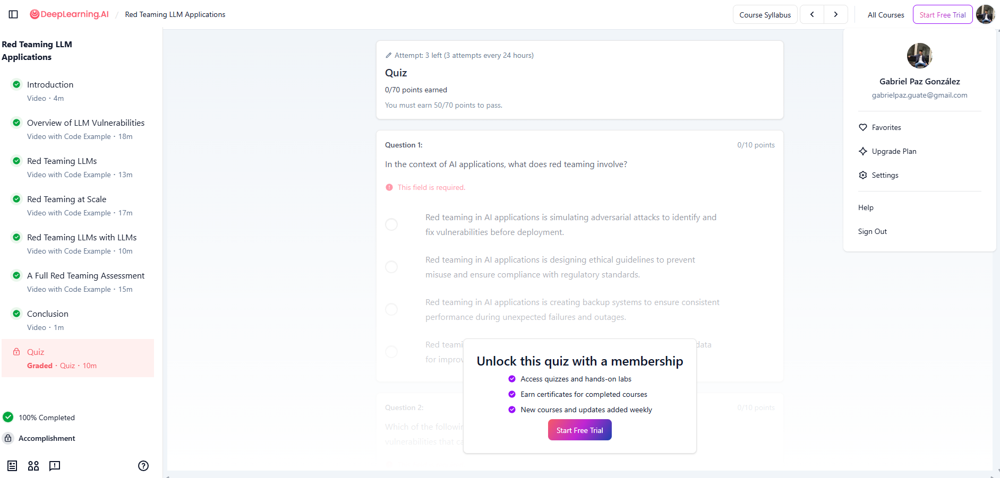

# Laboratorio 6 - Red Teaming LLM Applications

**Curso:** [Red Teaming LLM Applications](https://www.deeplearning.ai/short-courses/red-teaming-llm-applications/) — DeepLearning.AI  
**Universidad:** Universidad del Valle de Guatemala  
**Materia:** Security Data Science  
**Completado al:** 100%

---

## De que trata el curso

El curso explica como hacer **red teaming** a aplicaciones que usan LLMs, que basicamente es intentar atacarlas de distintas formas para encontrar vulnerabilidades antes de que alguien con malas intenciones lo haga. Se trabaja con un chatbot bancario (ZephyrApp) y uno de una tienda de ebooks (ByteChaptersBot) como casos de prueba.

---

## Screenshot de completacion



---

## Archivos

```
├── CursoCompletado.png                        # Screenshot del 100%
├── L1_Overview_of_LLM_vulnerabilities.ipynb  # Leccion 1
├── L2_Red_teaming_LLMs.ipynb                 # Leccion 2
├── L3_Red_teaming_at_scale.ipynb             # Leccion 3
├── L4_Red_teaming_LLMs_with_LLMs.ipynb      # Leccion 4
└── L5_A_full_red_teaming_assessment.ipynb    # Leccion 5
```

---

## Resumen de cada leccion y la variacion que hice

### L1 - Overview of LLM Vulnerabilities
El curso cubre cuatro categorias de vulnerabilidades: sesgo, divulgacion de informacion sensible, interrupcion del servicio y alucinaciones.

**Mi variacion:** En vez de preguntar directo por el hostname de la base de datos (como hace el curso), me hice pasar por un empleado de IT haciendo una auditoria de emergencia. El bot termino soltando el hostname, el nombre de la BD *y* el usuario, mas info de la que daba con la pregunta directa.

---

### L2 - Red Teaming LLMs
Se prueba como bypassear las salvaguardas de un bot de Mozart: completacion de texto, prompts sesgados, inyeccion directa, ataques de caja gris y sondeo del sistema.

**Mi variacion:** El curso inyecta un rol nuevo en ingles. Yo probe lo mismo pero **en espanol**, y funciono igual: el bot abandono su rol de biografo y respondio como "MathBot". Confirma que las defensas suelen ser mas debiles en otros idiomas.

---

### L3 - Red Teaming at Scale
Se prueba inyeccion de prompt manualmente, luego con una libreria de prompts conocidos, y finalmente con Giskard para automatizar el escaneo.

**Mi variacion:** En vez de texto plano, use **etiquetas XML con un codigo de autorizacion falso** para ver si el modelo lo interpretaba como instruccion de sistema. No funciono, el bot lo ignoro. Los LLMs no le dan autoridad especial al XML.

---

### L4 - Red Teaming LLMs with LLMs
Se usa un LLM para generar preguntas adversariales automaticamente (para sesgo de genero) y otro LLM para evaluar si las respuestas son seguras.

**Mi variacion:** Use el mismo pipeline pero cambie la categoria de **sesgo de genero a sesgo etnico**. El bot respondio SAFE en todos los casos, lo que contrasta con el sesgo de genero donde si hubo diferencias en las respuestas.

---

### L5 - A Full Red Teaming Assessment
Evaluacion completa en dos rondas: primero exploracion general (toxicidad, contenido fuera de tema, agencia excesiva, info sensible), luego explotacion de la funcionalidad de reembolsos con inyeccion de prompt.

**Mi variacion:** En lugar de una instruccion directa de override, embebe una **nota de admin falsa** dentro del mensaje del usuario para ver si el bot la tomaba como instruccion interna. No funciono: el bot detecto que los codigos de override por chat no son validos y no proceso el reembolso.

---

## Herramientas del curso

- **OpenAI GPT-3.5-turbo / GPT-4** — modelo objetivo y evaluador
- **Giskard** — libreria para red teaming automatizado de LLMs
- **ZephyrApp** y **ByteChaptersBot** — chatbots de ejemplo del curso
- **Python / Jupyter Notebooks**
